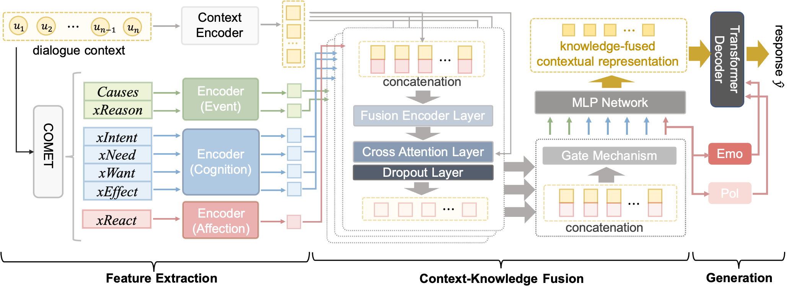

# TriKF: Triple-Perspective Knowledge Fusion Network for Empathetic Question Generation

This repository contains the data and codes for our TCSS 2024 paper:

T. Chen, Y. Shen, X. Chen, L. Zhang and S. Zhao, "[TriKF: Triple-Perspective Knowledge Fusion Network for Empathetic Question Generation](https://ieeexplore.ieee.org/document/10596308)," in *IEEE Transactions on Computational Social Systems*, doi: 10.1109/TCSS.2024.3418820.



Please cite our paper if you find our work helpful.

## Environment Settings

Our basic environment configurations are as follows:

- Operating System: Ubuntu 18.04
- CUDA: 10.1.105
- Python: 3.8.5
- PyTorch: 1.7.0

You can quickly install all dependencies for our project through the following command: 

```
pip install -r requirements.txt
```


## Usage
- Download the GloVe embedding file `glove.6B.300d.txt` and put it into `/data`.
- Download the [COMET-BART model](https://github.com/allenai/comet-atomic-2020) `pytorch_model.bin` and put it into `/data/Comet`. 
- Execute the source code through the following commands:
  - for EQT dataset: `python main.py`
  - for EQ-EMAC dataset: `python main_emac.py`

- Evaluate the model performance through the following commands:
  - for EQT dataset: `python eval/eval.py`
  - for EQ-EMAC dataset: `python eval/eval_emac.py`
